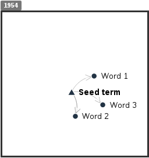
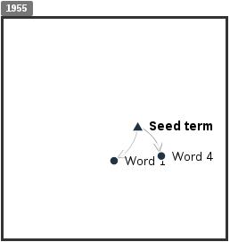

# ShiCo --  Exploring Shifting Concepts Through Time

## What is ShiCo?

ShiCo is a tool for visualizing time shifting concepts. We refer to a concept as the set of words which are related to a given seed word. ShiCo uses a set of semantic models (word2vec) spanning a number of years to explore how concepts change over time -- words related to a given concept at time *t=0* may differ from the words related to the same concept at time *t=n*. For example:

You can find more details of how the concept shift works [here](./docs/howItWorks.md) and you can read the user documentation [here](./docs/ui.md).

## How to use it?
You can read how to get your own instance of ShiCo up and running [here](./docs/deploy.md).

## How to extend it?
If you would like to modify ShiCo, read the developer manual [here](./docs/develop.md).

## The downloading function I added
Added the **Download** button to download the png files for the visualization and the **Download Vocabulary** button to download the csv file for the plain text vocabulary. For example, these are the downloaded files when using **young** as keyword:

## Licensing

Source code and data of ShiCo is licensed under the Apache License, version 2.0.